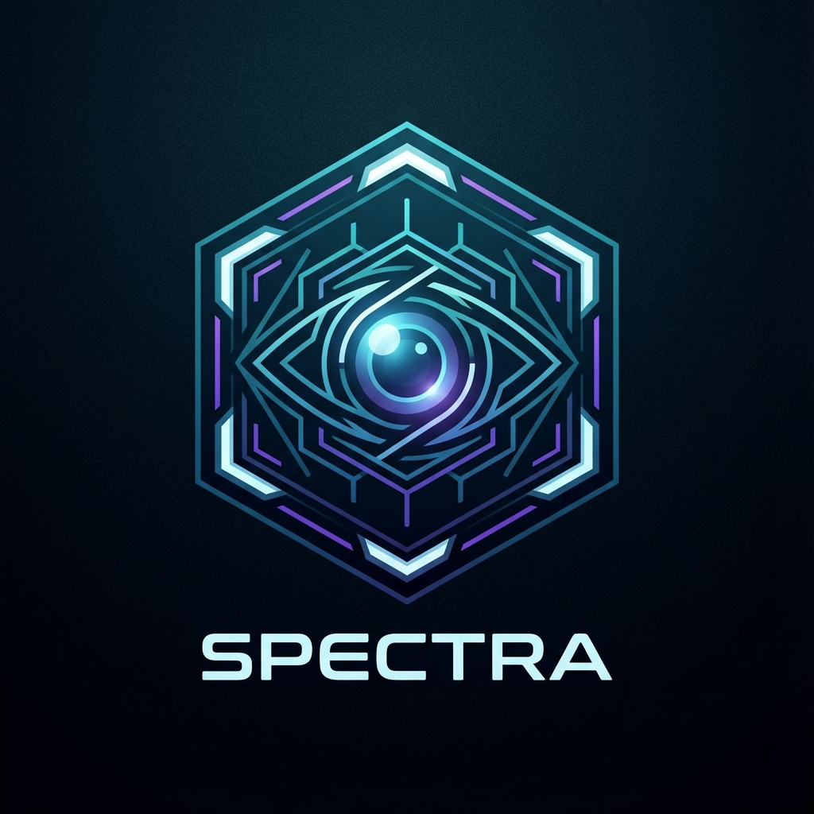

# SPECTRA OSINT PLATFORM

<div align="center">
  
  <h1>SPECTRA OSINT</h1>
  <p><strong>Advanced Browser-Based Intelligence Systems | Sistemas de Inteligencia Avanzada en Navegador</strong></p>

  <p>
    <a href="#english">🇬🇧 English</a> •
    <a href="#español">🇪🇸 Español</a>
  </p>

  
  
  
  
  
</div>

---

<a name="english"></a>
## 🇬🇧 English

### 1. Overview
**SPECTRA OSINT** is a professional-grade Open Source Intelligence platform designed for cybersecurity researchers, investigative journalists, and ethical hackers. Unlike traditional tools that require command-line knowledge or complex setups, SPECTRA runs entirely in the modern web browser, leveraging client-side processing for maximum privacy.

**Core Philosophy:**
- **Zero-Logs:** No data is stored on our servers.
- **Client-Side:** Heavy processing happens on your device.
- **Visual Intelligence:** Cyberpunk/Sci-Fi interface for immersive analysis.

### 2. Features (Tools)
*   **🌐 IP Tracker**: Deep geolocation, ISP analysis, and map visualization.
*   **📱 Phone Intel**: International carrier lookup, line type detection (VoIP/Mobile), and validation.
*   **📧 Email Recon**: Syntax validation, MX record checks, and breach verification (simulated/integrated).
*   **🔍 User Sherlock**: Scans 100+ social media platforms for target usernames.
*   **🔗 Malware Scanner**: Unshortens URLs and analyzes redirection paths for safety.
*   **👁️ Dork Studio**: Generates advanced Google Hacking queries for finding exposed files, cameras, and logs.
*   **💻 MAC Hunter**: Identifies hardware vendors via OUI (MAC Address) lookup.
*   **💰 Crypto Hunter**: Audits Bitcoin/Ethereum addresses for transaction counts and validity.
*   **📸 Exif Forensics**: Extracts hidden metadata (GPS, Device Info) from local image files.

### 3. Installation & Run
SPECTRA is built with React + Vite.

```bash
# Clone the repository
git clone https://github.com/josealvarezdev/spectra-osint.git

# Navigate to frontend directory
cd spectra-osint/frontend

# Install dependencies
npm install

# Run development server
npm run dev
```
Open `http://localhost:5173` in your browser.

### 4. Legal Disclaimer
**SPECTRA OSINT** is strictly for **educational and legal research purposes**. The developers are not responsible for any misuse of the provided tools. DO NOT use this software for doxxing, stalking, or illegal surveillance. Always verify your local laws regarding OSINT and data privacy.

---

<a name="español"></a>
## 🇪🇸 Español

### 1. Descripción General
**SPECTRA OSINT** es una plataforma de Inteligencia de Fuentes Abiertas (OSINT) de nivel profesional diseñada para investigadores de ciberseguridad, periodistas de investigación y hackers éticos. A diferencia de las herramientas tradicionales que requieren conocimientos de línea de comandos o configuraciones complejas, SPECTRA se ejecuta completamente en el navegador web moderno, aprovechando el procesamiento del lado del cliente para una privacidad máxima.

**Filosofía Central:**
- **Cero Registros:** No se almacenan datos en nuestros servidores.
- **Lado del Cliente:** El procesamiento pesado ocurre en tu dispositivo.
- **Inteligencia Visual:** Interfaz Cyberpunk/Sci-Fi para un análisis inmersivo.

### 2. Características (Herramientas)
*   **🌐 Rastreador IP**: Geolocalización profunda, análisis de ISP y visualización en mapa.
*   **📱 Intel Telefónica**: Búsqueda de operadoras internacionales, detección de tipo de línea (VoIP/Móvil) y validación.
*   **📧 Check Email**: Validación de sintaxis, verificación de registros MX y comprobación de brechas.
*   **🔍 Búsqueda Usuario**: Escanea más de 100 plataformas sociales buscando nombres de usuario objetivo.
*   **🔗 Escáner Malware**: Desacorta URLs y analiza rutas de redirección por seguridad.
*   **👁️ Estudio Dork**: Genera consultas avanzadas de Hacking de Google para encontrar archivos expuestos, cámaras y registros.
*   **💻 Cazador MAC**: Identifica fabricantes de hardware vía búsqueda OUI (Dirección MAC).
*   **💰 Cazador Crypto**: Audita direcciones de Bitcoin/Ethereum para recuento de transacciones y validez.
*   **📸 Forense Imágenes**: Extrae metadatos ocultos (GPS, Info del Dispositivo) de archivos de imagen locales.

### 3. Instalación y Ejecución
SPECTRA está construido con React + Vite.

```bash
# Clonar el repositorio
git clone https://github.com/josealvarezdev/spectra-osint.git

# Navegar al directorio frontend
cd spectra-osint/frontend

# Instalar dependencias
npm install

# Iniciar servidor de desarrollo
npm run dev
```
Abre `http://localhost:5173` en tu navegador.

### 4. Aviso Legal
**SPECTRA OSINT** es estrictamente para **fines educativos y de investigación legal**. Los desarrolladores no se hacen responsables de ningún mal uso de las herramientas proporcionadas. NO utilicest este software para doxxing, acoso o vigilancia ilegal. Verifica siempre tus leyes locales sobre OSINT y privacidad de datos.

---

<div align="center">
  <p>Developed by <strong>Jose Alvarez Dev</strong></p>
  <p>© 2026 SPECTRA OSINT. MIT License.</p>
</div>
